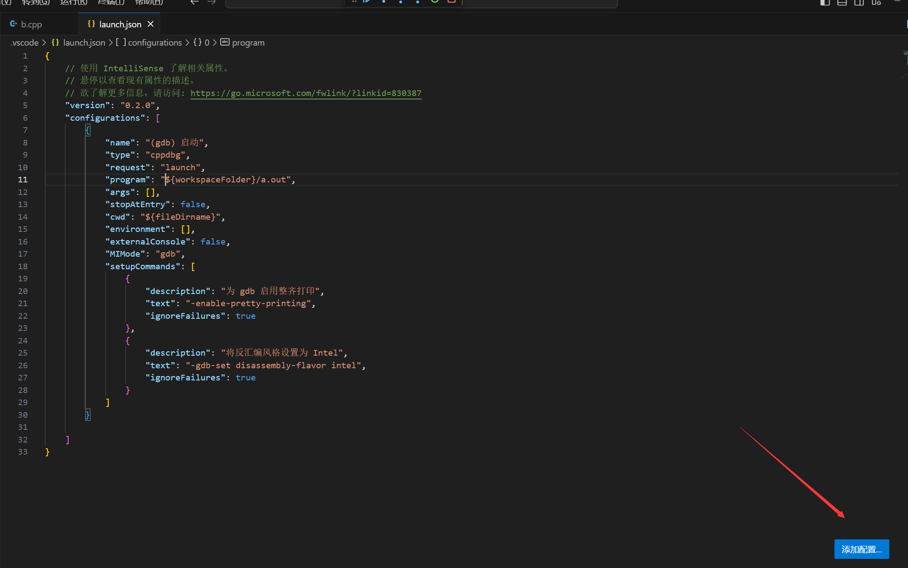
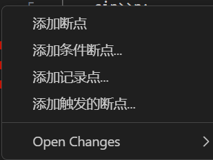
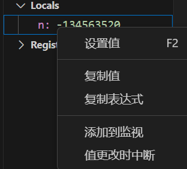

# VsCode
## ShortCut
alt+z 对一行很长的字符，多行表示一行

对于 行 的操作：
重开一行：光标在行尾的话，回车即可；
                 不在行尾，ctrl + enter 向下重开一行
	ctrl+shift + enter 则是在上一行重开一行删除一行：
光标没有选择内容时，ctrl + x 剪切一行；
ctrl +shift + k 直接删除一行移动一行：
alt + ↑ 向上移动一行；
alt + ↓ 向下移动一行复制一行：
shift + alt + ↓ 向下复制一行；
shift + alt + ↑ 向上复制一行
ctrl + z 回退对于 词 的操作：
选中一个词：ctrl + d 
搜索或者替换：ctrl + f ：
搜索ctrl + alt + f： 
替换ctrl + shift + f：
在项目内搜索通过Ctrl + ` 可以打开或关闭终端
Ctrl+P 快速打开最近打开的文件
Ctrl+Shift+N 
打开新的编辑器窗口
Ctrl+Shift+W 关闭编辑器
Ctrl + Home 跳转到页头
Ctrl + End 跳转到页尾

## Markdown的图片保存路径问题
vscode在2023年的时候内置了快速粘贴剪切版的音视频，图片。
对于图片，如果想改变保存位置，需要到扩展里面的MarkDown里面修改Markdown › Copy Files: Destination。或者在setting.json加上，具体的一些路径宏在注释里面。
```json
"markdown.copyFiles.destination": {
  "*.md": "${documentDirName}/.assert/${fileName}"
}
```
> VSCode 在 2023.05 发布了 1.79 版本，提供了一项名为 Automatic copy of external files 的新功能，当用户使用拖拽或粘贴将外部媒体文件（比如图片、音视频）放置到 Markdown 文档上时，VSCode 会自动复制一份文件到工作区，并在 Markdown 文档中插入相应的图片引用片段。

[link](https://juejin.cn/post/7244809769794289721)

## 什么是工作区

## debug

vscode自带的 运行与调试。

启动依赖`.vscode`里面的`launch.json`配置。但现在只需要点击右下角的添加配置即可（有的需要插件来提供），悬停也会有很详细的说明。



配置完成后就可以调试了。


断点是可以动态加的好吧。

1. Continue 继续: 运行到下一个断点
2. Step Over 步进：不会进入函数，直接得到返回值 
3. Step into 步入 ：进入函数
4. Step out 步出 ：运行到退出当前函数

右键菜单有一些功能，比如查看汇编。

对于断点：


对于变量：


相对于gdb确实友好很多。

### 死循环
gdb attach附加

## link
[hanzuxiaozi](https://www.bilibili.com/video/BV1Aj411N7Ne/?vd_source=2ae0b3d86625359b9f3be85ab7c6e76e)